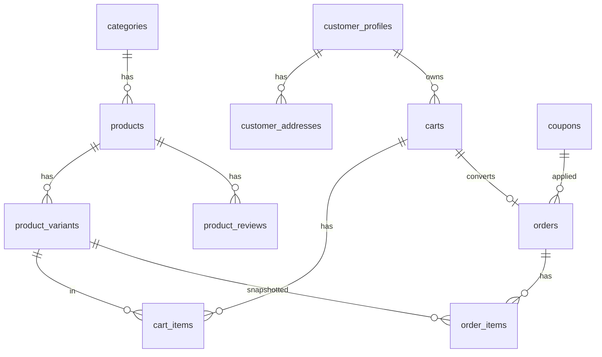

# Plano Feliora — Loja de Moda Feminina (final consolidado)

Referência de arquitetura: [`C:\Users\ghaam\Desktop\nativa-store\nativa-store`](C:\Users\ghaam\Desktop\nativa-store\nativa-store). Projeto novo em [`c:\Users\ghaam\Desktop\feliora`](c:\Users\ghaam\Desktop\feliora) (hoje só a logo). **Sem monorepo, sem Express separado** — API via Route Handlers do Next.js.

**Status:** decisões 1–7 fechadas. Pronto para aprovação e início da **Fase 0**.

---

## Decisões fechadas (7 pontos + NF)

| # | Tema | Decisão |
|---|------|---------|
| 1 | Estoque | **(b) Variantes reais** — `product_variants` (produto × tamanho × cor × sku × stock). **Confirmado sem alteração.** Supabase é fonte de verdade do estoque **do site**. |
| 2 | Carrinho guest | Cookie httpOnly `feliora_sid` (UUID), criado no **primeiro add-to-cart**; merge no login/cadastro |
| 3 | Concorrência | Baixa **atômica via RPC** (`FOR UPDATE` + validação + decremento). **Confirmado sem alteração** — suficiente; não há sync externo nesta fase. |
| 4 | Rose-gold | `--color-rose-gold` = `#B76E79`; `--color-rose-gold-light` = `#C9A07A` |
| 5 | LGPD | Banner cookies + `/pages/privacidade` + opt-in marketing desmarcado por padrão (MVP) |
| 6 | NF / marketplaces | **Fora do código da Feliora.** Upseller sem API pública → NF, Shopee e TikTok Shop operados **manualmente** fora da plataforma. Sem botão “Emitir NF”, sem API Upseller, sem painel consolidado de pedidos marketplace, sem sync de estoque entre canais. |
| 7 | Busca | Postgres (`tsvector` + fallback `ilike`); sem Algolia/Meilisearch no MVP |

---

## 1. Estrutura de pastas (Next.js único)

```
feliora/
├── public/
│   ├── images/logo-feliora.*
│   └── textures/paper-grain.svg
├── src/
│   ├── app/
│   │   ├── (store)/
│   │   │   ├── page.tsx                 # Home
│   │   │   ├── catalogo/
│   │   │   ├── categoria/[slug]/
│   │   │   ├── produto/[slug]/
│   │   │   ├── carrinho/
│   │   │   ├── checkout/
│   │   │   ├── conta/
│   │   │   ├── favoritos/
│   │   │   ├── pages/[slug]/           # institucionais + privacidade
│   │   │   └── busca/
│   │   ├── (admin)/admin/
│   │   │   ├── page.tsx                 # dashboard
│   │   │   ├── produtos/                # CRUD + matriz de variantes
│   │   │   ├── pedidos/                 # somente pedidos do site
│   │   │   ├── clientes/
│   │   │   ├── cupons/
│   │   │   ├── banners/
│   │   │   ├── avaliacoes/
│   │   │   ├── categorias/
│   │   │   ├── settings/
│   │   │   └── integracoes/             # MP / ME / Brevo apenas
│   │   ├── api/
│   │   │   ├── admin/
│   │   │   ├── products/
│   │   │   ├── cart/
│   │   │   ├── orders/
│   │   │   ├── search/
│   │   │   ├── shipping/
│   │   │   ├── upload/
│   │   │   ├── webhooks/                # mercado-pago, brevo
│   │   │   └── newsletter/
│   │   ├── sitemap.ts
│   │   ├── robots.ts
│   │   ├── layout.tsx                   # CookieConsent
│   │   └── not-found.tsx
│   ├── components/   # store, checkout, admin, legal, ui
│   ├── lib/          # supabase, auth, crypto, images, search, integrations
│   ├── contexts/     # cart, wishlist
│   ├── shared/       # const, types, schemas, mappers
│   └── styles/globals.css
├── supabase/
├── .env.example
└── package.json
```

**Backend:** Route Handlers em `app/api/*` no mesmo deploy Vercel (cookies same-origin, sem Express).

**Integrações no código:** só Mercado Pago, Melhor Envio e Brevo. Nada de Upseller / NF-e / Shopee / TikTok Shop.

---

## 2. Schema do banco (Supabase / Postgres)

Adaptado do core da Nativa; **sem** regions, quiz, artisan, style_tags, region_id, is_map_reward.

### 2.1 Estoque — (b) variantes reais (inalterado)

- `products.sizes` / `products.colors`: **só exibição** (ordem dos swatches, hex).
- `product_variants`: `id`, `product_id`, `size_label`, `color_name`, `sku` unique, `stock_count` ≥ 0, `is_active`, unique `(product_id, size_label, color_name)`.
- Agregados no produto: `in_stock` = existe variante com stock > 0; `stock_count` = soma das variantes.

**Fonte de verdade:** Supabase = estoque **do site**. Canais TikTok/Shopee são independentes e manuais nesta fase — sem sync.

### 2.2 Demais tabelas core

| Tabela | Papel |
|--------|--------|
| `categories` | Seed: Vestidos, Blusas, Calças, Acessórios |
| `products` | Catálogo + `search_vector` + dims frete |
| `product_variants` | Estoque real |
| `product_reviews` | Moderação admin; cache `rating_avg` / `reviews_count` |
| `carts` | Guest `session_id` **ou** `customer_id`; `status` active/converted |
| `cart_items` | Ver schema explícito abaixo — chave = **`variant_id`** |
| `orders` / `order_items` | Pedidos do site; itens com **`variant_id`** — ver abaixo |
| `customer_profiles` / `customer_addresses` | Supabase Auth |
| `coupons` | percentage / fixed / free_shipping |
| `banners` | Desktop + mobile |
| `store_settings` | Contato / redes / WhatsApp |
| `content_pages` | Inclui seed `privacidade` |
| `marketing_subscriptions` | Opt-in explícito (`consent_at`, `consent_source`) |
| `admin_users` | E-mail + password_hash; JWT `feliora_admin_token` |
| Settings MP / ME / Brevo + `payment_attempts`, `shipping_quotes`, etc. | Padrão Nativa (secrets criptografados) |

#### Schema explícito — `cart_items` e `order_items` (decisão 1 até o fim)

A unidade de linha **não** é mais `(product_id, size_label, color_name)` soltos. O vínculo canônico é **`variant_id`**. Labels de tamanho/cor existem só como **snapshot** imutável (histórico se a variante for editada/desativada depois).

**`cart_items`**
- `id`, `cart_id` FK → `carts`
- **`variant_id` FK → `product_variants` (obrigatório)**
- `quantity`, `unit_price`
- Snapshots: `product_name`, `product_slug`, `product_image`, `sku`, `size_label`, `color_name`
- Unique: `(cart_id, variant_id)`

**`order_items`**
- `id`, `order_id` FK → `orders`
- **`variant_id` FK → `product_variants` (nullable SET NULL se variante for removida depois — snapshot permanece)**
- `quantity`, `price`
- Snapshots: `product_name`, `product_slug`, `image`, `sku`, `size_label`, `color_name`

Add-to-cart, merge, checkout e RPC de estoque operam sempre sobre `variant_id`.

Consentimento de cookies no MVP: cookie client `feliora_cookie_consent` + versão da política (sem tabela obrigatória).

### 2.2.1 RLS (incluindo `product_variants`)

| Tabela | SELECT (anon/authenticated) | Escrita |
|--------|----------------------------|---------|
| `products` | Público (catálogo ativo; política alinhada à Nativa) | Só service role (Route Handlers / admin) |
| **`product_variants`** | **Público se `is_active = true`** (mesma ideia de leitura pública do produto — storefront precisa ler estoque/disponibilidade sem auth) | **Só service role** — nunca UPDATE de `stock_count` pelo client; baixa só via RPC |
| `categories`, `banners`, `content_pages` | Ativos / publicados | Service role |
| `product_reviews` | Só `is_approved = true` | Insert autenticado ou via API; moderação admin |
| `carts` / `cart_items` | Via API (service role) ou policies por `session_id`/`customer_id` — padrão Nativa | Via Route Handlers |
| `orders` | Cliente só os próprios; admin via service role | Service role / RPCs |
| Settings MP/ME/Brevo, `admin_users` | Sem SELECT público | Service role |

`product_variants` **não** fica de fora: mesma regra de leitura pública (variante ativa) + escrita exclusiva service role / RPC.

### 2.3 Carrinho guest

| Aspecto | Decisão |
|---------|---------|
| Id | UUID em cookie httpOnly `feliora_sid` (SameSite=Lax, ~180 dias) |
| Criação | **Primeiro add-to-cart** (server cria cookie + row `carts`) |
| Login | `POST /api/cart/merge` — mescla por `variant_id` ou associa cart ao `customer_id` |
| Logout | Cart logado permanece no customer; novo guest vazio no próximo add |

### 2.4 Concorrência de estoque (inalterado — sem sync externo)

1. Create: valida disponibilidade (não decrementa).
2. Approve (webhook/reconcile MP): RPC com `SELECT … FOR UPDATE`, valida qty, decrementa, atualiza pedido — **tudo atômico**.
3. Edge case create→approve sem estoque: tratamento manual / estorno.
4. Nenhum `UPDATE` de estoque fora dessas RPCs. Hold/`reserved_qty` = pós-MVP opcional.



---

## 3. Páginas

### Storefront (mobile-first)

| Rota | Notas |
|------|--------|
| `/` | Hero lookbook; 1º viewport: brand + headline + CTA + imagem |
| `/catalogo` | Grid 2→3–4 cols; FilterSheet |
| `/categoria/[slug]` | ISR + metadata |
| `/produto/[slug]` | Galeria, swatches→variante, reviews, JSON-LD, OG |
| `/carrinho` | Resumo sticky mobile |
| `/checkout` | CEP, frete ME, pagamento MP |
| `/conta/*` | Auth + merge carrinho |
| `/favoritos` | Wishlist localStorage |
| `/busca` | Postgres FTS |
| `/pages/[slug]` | Sobre, trocas, **privacidade**, frete |
| `not-found` | 404 Feliora |

**LGPD (MVP):** CookieConsent no layout · página privacidade · newsletter só com checkbox desmarcado.

### Admin (somente canal site)

Dashboard · Produtos (matriz variantes) · Categorias · **Pedidos do site** · Clientes · Cupons · Banners · Avaliações · Settings · Integrações (MP / ME / Brevo).

Sem: Emitir NF · Upseller · pedidos TikTok/Shopee · sync multicanal.

---

## 3.1 Design system

| Token | Valor | Uso |
|-------|-------|-----|
| `--color-cream` | `#FDF8F4` | fundo |
| `--color-ivory` | `#F7F0E8` | seções |
| `--color-rose-gold` | `#B76E79` | CTAs, bordas, wordmark |
| `--color-rose-gold-light` | `#C9A07A` | hover / gradiente |
| `--color-blush` | `#D4A59A` | badges / accent |
| `--color-earth` | `#8C7B6A` | muted |
| `--color-ink` | `#2C241B` | texto |
| `--color-ink-muted` | `#6B5E52` | secundário |
| `--color-line` | `rgba(183,110,121,0.25)` | divisores |

Tipografia: **Cormorant Garamond** + **Outfit**. Bordas finas, whitespace, grain sutil, motion discreto. `site.ts`: Feliora, theme `#B76E79`, bg `#FDF8F4`, logo oficial.

---

## 4. Infraestrutura (env a configurar)

**Obrigatórias:** `NEXT_PUBLIC_SUPABASE_URL`, `NEXT_PUBLIC_SUPABASE_ANON_KEY`, `SUPABASE_SECRET_KEY`, `APP_URL` / `NEXT_PUBLIC_APP_URL`, `ADMIN_JWT_SECRET`, `ADMIN_BOOTSTRAP_EMAIL` + `ADMIN_BOOTSTRAP_PASSWORD`, `MERCADO_PAGO_ENCRYPTION_KEY`, `MELHOR_ENVIO_ENCRYPTION_KEY`, `BREVO_ENCRYPTION_KEY`.

**Opcionais:** `BREVO_WEBHOOK_TOKEN`, WhatsApp, Meta Pixel, `ANALYTICS_EXCLUDE_IPS`.

**Checklist humano:** projeto Supabase + Storage · contas MP/ME/Brevo (credenciais no admin) · Vercel + domínio.

**Upload:** sharp → WebP + 400/800/1200w → Storage → `next/image`.

---

## 5. SEO

`generateMetadata` · ISR + `revalidatePath` · slugs · `sitemap.ts` / `robots.ts` · OG/Twitter · JSON-LD Product · anti-CLS no grid.

---

## 6. Busca

Postgres: coluna `search_vector` + GIN; `plainto_tsquery('portuguese')` + fallback `ilike`. `GET /api/search?q=` → `/busca`. Sem serviço externo no MVP.

---

## 7. NF / Upseller / marketplaces (fechado — fora do MVP)

- Upseller **não tem API pública** → nenhuma integração no código.
- NF emitida **manualmente** fora da Feliora (Upseller / painéis marketplace).
- Estoque e pedidos TikTok Shop / Shopee: **independentes**, operação manual.
- Admin Feliora = **apenas pedidos do site**.
- Decisões 1 e 3 permanecem exatamente como no plano original (variantes + RPC local).

---

## 8. Ordem de implementação (MVP)

| Fase | Entrega | Pronto quando |
|------|---------|---------------|
| **0 — Foundation** | Next + Tailwind + tokens + `site.ts` + logo + layout + 404 | Home estática Feliora |
| **1 — Schema** | SQL + `product_variants` + RPCs estoque + Zod + seed categorias | Queries OK |
| **2 — Catálogo** | Home, grid, PDP, Quick View, filtros, busca | Navegação sem checkout |
| **3 — Carrinho** | `feliora_sid` + wishlist local | Guest cart |
| **4 — Auth** | Supabase Auth + merge carrinho | Conta |
| **5 — Admin** | CRUD produtos/variantes/… + WebP | Catálogo populável |
| **6 — Checkout** | ME + MP + RPC no approve | Pedido pago sandbox |
| **7 — Brevo + fulfillment** | E-mails + tracking site | Pós-venda |
| **LGPD** (paralelo 0–4) | CookieConsent + privacidade + opt-in | Compliance mínimo |
| **8 — SEO + polish** | metadata, sitemap, JSON-LD, reviews | Soft launch |

Pós soft launch (ainda MVP-adjacente, não Fase 9): wishlist em conta, Meta Pixel, analytics, multi-admin, hold de estoque no create.

---

## 9. Fase 9 — Futuro / fora de escopo do MVP

Somente **nota de intenção** — sem desenho técnico nesta rodada:

- Publicar cadastro de produto uma vez na Feliora e refletir em TikTok Shop e Shopee
- Atualização automática de estoque entre canais a partir da Feliora
- Será desenhado quando APIs/parcerias estiverem definidas (Upseller hoje não oferece API pública)

---

## 10. O que explicitamente não entra no MVP

- Quiz / Mapa / artesão / origem / paleta Nativa
- Express separado / monorepo
- Algolia / Meilisearch
- Emissão de NF-e no código ou botão “Emitir NF”
- Integração Upseller / Shopee / TikTok Shop
- Sync de estoque multicanal
- Painel consolidado de pedidos marketplace
