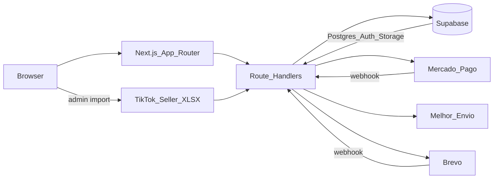

<p align="center">
  
</p>
<p align="center"><sub>Flow: Home → Product → Cart → Checkout (auth) → Admin</sub></p>

<h1 align="center">Feliora</h1>
<p align="center"><i>Women's fashion with delicacy</i></p>

<p align="center">
  <a href="README.md">🇧🇷 Português</a> ·
  <a href="README.en.md">🇺🇸 English</a>
</p>

<p align="center">
  
  <a href="https://nextjs.org/"></a>
  <a href="https://react.dev/"></a>
  <a href="https://www.typescriptlang.org/"></a>
  <a href="https://tailwindcss.com/"></a>
  <a href="https://supabase.com/"></a>
  <a href="https://vercel.com/"></a>
  <a href="LICENSE"></a>
</p>

<p align="center">
  <a href="https://www.feliora.com.br"></a>
  <a href="https://github.com/gabriel-s-amorim/feliora"></a>
</p>

> A women's fashion e-commerce built in partnership — public storefront, admin panel, and checkout / shipping / marketplace integrations — with its own rose-gold / cream identity and production-minded architecture, not a tutorial CRUD.

**Full e-commerce platform** — size×color variants, hybrid guest + authenticated cart, Mercado Pago + Melhor Envio checkout, TikTok Shop spreadsheet import, deployed on Vercel.

---

## Table of contents

- [Why this project?](#why-this-project)
- [Features](#features)
- [Main challenges](#main-challenges)
- [Architecture](#architecture)
- [Stack](#stack)
- [Security](#security)
- [Results](#results)
- [Screenshots](#screenshots)
- [Running locally](#running-locally)
- [Technical decisions](#technical-decisions)
- [What I learned](#what-i-learned)
- [Roadmap](#roadmap)
- [Automated screenshot capture](#automated-screenshot--video-capture)

---

## Why this project?

Feliora started as a real women's fashion operation online: pieces with presence, careful finishing, and a brand that must feel like a boutique — not a generic template.

The project solves problems that only show up when the catalog comes from suppliers and marketplaces, stock is per SKU (size × color), and visitors need to buy with low friction:

- **Own visual identity** — cream / rose-gold (`#B76E79`), serif display (Cormorant Garamond) + sans (Outfit), logo and lookbook — not a default purple theme
- **TikTok Shop catalog import via spreadsheet** while the official API is still pending approval — with `marketplace_*` channel modeling ready to swap the connector without rewriting the domain
- **Guest cart** with `httpOnly` cookie `feliora_sid` and merge on login
- **Fashion variants** — real stock on `product_variants`, not a loose field on the product
- **Checkout and fulfillment** — Mercado Pago, Melhor Envio, Brevo email, webhooks with reconciliation

The goal was to ship the store the operation needs today, with architectural headroom for what comes next (TikTok API, SEO, stock sync).

---

## Features

### Storefront (customer)

| Feature | Detail |
|---------|--------|
| Catalog & PDP | Grid, filters, Quick View, Fancybox gallery, color swatches and size selector |
| Variants | Size×color SKUs with per-variant stock; price and availability on the PDP |
| Cart | Dedicated page + drawer; guest session via `feliora_sid`; merge on auth |
| Checkout | Requires an account; address, shipping (Melhor Envio), coupon, Mercado Pago (Pix / card / boleto) |
| Account | Email/password + Google OAuth (Supabase Auth); orders and notifications |
| Search | `/busca` over name and description (currently `ILIKE`; FTS index already exists in Postgres) |
| SEO | Product JSON-LD, `sitemap.ts` / `robots.ts`, canonical `www.feliora.com.br` |
| LGPD (MVP) | Cookie banner, `/pages/privacidade`, explicit newsletter opt-in |

> Payment and shipping environments (test/sandbox vs production) are configurable under `/admin/integracoes`.

### Admin panel (`/admin`)

| Feature | Detail |
|---------|--------|
| Dashboard | First-party analytics (visitors, sessions, pages, devices) and catalog shortcuts |
| Products | CRUD, Supabase Storage uploads, variant matrix |
| **TikTok import** | `.xlsx` upload (Seller Center Bulk Edit / All Information), parse, preview, import job |
| Orders | List, detail, cancel with stock restore, messages |
| Customers / categories / coupons / banners | Full management |
| Channels | Shopee and TikTok settings (`marketplace_channel_settings`) |
| Integrations | Mercado Pago, Melhor Envio, Brevo — credentials encrypted (AES-256-GCM) |
| Admin auth | JWT in `httpOnly` cookie `feliora_admin_token` + bcrypt (serverless-friendly) |

---

## Main challenges

**Modeling fashion without exploding the domain.** Craft often needs one SKU; fashion size × color creates combinations and independent stock. The answer was `product_variants` as the sellable unit, aggregated stock on the product, and atomic decrement per variant.

**Bringing the TikTok Shop catalog without the official API.** The operation needed to publish pieces already in Seller Center. We built an `.xlsx` importer (parse → map → job) and, in parallel, the `marketplace_*` schema (settings, links, sync jobs) so the official API can replace the connector without rewriting products and variants.

**A guest cart that survives login.** Cookie `feliora_sid` (`httpOnly`, 180 days) identifies the anonymous cart; on login, `POST /api/cart/merge` unifies items without destructive duplicates.

**Overselling under concurrency.** Stock is not decremented on the client: RPC `decrement_variant_stock` with `FOR UPDATE`, stable ordering by `variant_id`, and `service_role`-only execution on checkout / Mercado Pago reconcile / marketplace orders.

**SEO and brand in the same deploy.** Product JSON-LD on the PDP, dynamic sitemap, apex → www redirect on Vercel, and brand tokens in CSS (Tailwind 4 `@theme`) so the first viewport already reads as Feliora.

---

## Architecture

Next.js App Router at the repo root — Route Handlers as BFF, Supabase as Postgres + Auth + Storage:

```
feliora/
├── src/
│   ├── app/
│   │   ├── (store)/           # public storefront
│   │   ├── (admin)/admin/     # admin panel
│   │   ├── api/               # Route Handlers (cart, checkout, webhooks, admin…)
│   │   ├── auth/callback/     # Supabase OAuth
│   │   ├── globals.css        # rose-gold / cream tokens
│   │   ├── sitemap.ts / robots.ts
│   ├── components/            # store, admin, checkout, seo, legal
│   ├── contexts/              # cart, customer auth, admin auth
│   ├── lib/                   # cart, orders, crypto, marketplace, seo, tiktokImport…
│   ├── shared/                # const, Zod schemas, types
│   └── middleware.ts          # Supabase session refresh
├── supabase/                  # SQL 00–21 (37 tables)
├── scripts/capture-screenshots.ts
└── docs/screenshots/
```



---

## Stack

| Layer | Technology |
|-------|------------|
| Framework | Next.js 16.2 (App Router) |
| UI | React 19.2, Tailwind CSS 4.3, Lucide, Fancyapps UI |
| Language | TypeScript 5.9 |
| Validation | Zod 4 |
| BaaS | Supabase (PostgreSQL, Auth, Storage) |
| Store auth | Supabase Auth (email + Google OAuth) |
| Admin auth | JWT (`jose`) + bcrypt in httpOnly cookie |
| Payments | Mercado Pago (`@mercadopago/sdk-react`) |
| Shipping | Melhor Envio |
| Email | Brevo |
| Marketplace import | `xlsx` (TikTok Seller Center) |
| Crypto | AES-256-GCM for integration secrets |
| Deploy | Vercel → [www.feliora.com.br](https://www.feliora.com.br) |

---

## Security

- **Postgres RLS** — public catalog only reads active/published rows; customer data scoped by `auth.uid()`; cart, settings, and marketplace have no public policies (`service_role` via Route Handlers)
- **httpOnly cookies** — `feliora_sid` (cart), `feliora_admin_token` (admin); `sameSite=lax`, `secure` in production
- **Third-party credentials** — AES-256-GCM (`v1.iv.tag.payload`) before persisting to the database
- **LGPD (MVP)** — cookie consent, privacy policy, newsletter opt-in unchecked by default, analytics gated on consent
- **Webhooks** — Mercado Pago, Brevo, Shopee, and TikTok on dedicated routes with provider-specific validation
- **Security headers** — configured in `next.config.ts`

---

## Results

Traffic / Lighthouse numbers are not documented in the repo — we prefer not to invent metrics.

What is verifiable in code and deploy:

| Result | Evidence |
|--------|----------|
| Live store on a custom domain | [www.feliora.com.br](https://www.feliora.com.br) |
| Complete data model | **37 tables** under `supabase/` (`00`–`21`) |
| Concurrency-safe stock | RPC `decrement_variant_stock` |
| TikTok → catalog bridge | `.xlsx` importer + `marketplace_*` schema |
| Product SEO | Product JSON-LD on the PDP |
| <!-- TODO: fill with real data --> | <!-- e.g. Lighthouse score, imported SKU count, CWV --> |

---

## Screenshots

<p align="center"><b>Home</b> — full-bleed hero, brand, CTA</p>
<p align="center">
  
</p>

<p align="center"><b>Catalog</b> — product grid</p>
<p align="center">
  
</p>

<p align="center"><b>Product page</b> — gallery, sizes, and colors</p>
<p align="center">
  
</p>

<p align="center"><b>Cart</b> — line item, quantity, summary</p>
<p align="center">
  
</p>

<p align="center"><b>Empty cart</b> — empty state</p>
<p align="center">
  
</p>

<p align="center"><b>Checkout</b> — requires authentication (redirect to login with <code>?next=/checkout</code>)</p>
<p align="center">
  
</p>

<p align="center"><b>Customer account</b> — email/password and Google login</p>
<p align="center">
  
</p>

<p align="center"><b>Admin</b> — panel login</p>
<p align="center">
  
</p>

<p align="center"><b>Admin</b> — analytics dashboard</p>
<p align="center">
  
</p>

<p align="center"><b>Admin</b> — product management</p>
<p align="center">
  
</p>

<p align="center"><b>Admin</b> — TikTok Shop importer (.xlsx)</p>
<p align="center">
  
</p>

<p align="center"><b>Admin</b> — order management</p>
<p align="center">
  
</p>

<p align="center"><b>Mobile</b> — home (390×844)</p>
<p align="center">
  
</p>

---

## Running locally

### Prerequisites

- Node.js 20+
- npm
- A [Supabase](https://supabase.com) project with `supabase/*.sql` applied in numeric order

### Setup

```bash
npm install
cp .env.example .env.local
# Fill NEXT_PUBLIC_SUPABASE_*, SUPABASE_SECRET_KEY,
# ADMIN_JWT_SECRET, ADMIN_BOOTSTRAP_* and ENCRYPTION_KEY values (≥32 chars)
```

Run the SQL scripts in the Supabase SQL Editor from `00` → `21` (see [`supabase/README.md`](supabase/README.md)). For a sample catalog, also run `09_seed_demo_optional.sql`.

```bash
npm run dev
```

Open [http://localhost:3000](http://localhost:3000). Admin: [http://localhost:3000/admin/login](http://localhost:3000/admin/login).

| Command | Description |
|---------|-------------|
| `npm run dev` | Dev server |
| `npm run build` | Production build |
| `npm run start` | Serve the build |
| `npm run lint` | ESLint |
| `npm run capture:screenshots` | Screenshots + GIF (Playwright) |

Env details: [`.env.example`](.env.example).

---

## Technical decisions

| Problem | Solution |
|---------|----------|
| Size×color combinations with real stock | `product_variants` table + aggregated stock sync on the product |
| TikTok catalog before the official API | `.xlsx` import + `marketplace_*` tables ready for the official connector |
| Guest ↔ customer cart | `feliora_sid` cookie + merge at `/api/cart/merge` |
| Overselling | RPC `decrement_variant_stock` (`FOR UPDATE`, `service_role` only) |
| MP / Melhor Envio / Brevo / marketplace secrets | AES-256-GCM in `*_encrypted` columns |
| Admin on Vercel serverless | httpOnly JWT (`feliora_admin_token`), no in-memory session |
| Product SEO | Product JSON-LD + sitemap/robots + canonical www |
| LGPD in the MVP | Cookie consent + `/pages/privacidade` + marketing opt-in |
| Search | FTS index (`search_vector`) in Postgres; storefront query still `ILIKE` (roadmap) |
| Shared validation | Zod schemas in `src/shared/schemas` |

---

## What I learned

- **Next.js App Router as a BFF**: UI and Route Handlers in one deploy, with clear storefront vs admin boundaries
- **Relational modeling for fashion**, treating the variant as the SKU and the product as a presentation aggregate
- **Hybrid carts** in a stateless environment (httpOnly cookies + idempotent merge)
- **Postgres RPCs and locks** for stock under real checkout and webhook concurrency
- **Payment, shipping, and email integrations** with encrypted credentials and reconciliable webhooks
- **Pragmatic marketplace bridging** — spreadsheet today, schema ready for the API tomorrow
- **SEO and LGPD** as MVP requirements, not “phase 2”
- **Brand design systems** via CSS tokens on Tailwind 4, without fighting a generic theme

---

## Roadmap

- [ ] Wire storefront search to `search_vector` (Portuguese FTS) instead of `ILIKE`
- [ ] Adopt the official TikTok Shop API when approved (replace/complement XLSX)
- [ ] Expand bidirectional stock/price sync across marketplace channels
- [ ] <!-- TODO: fill with real data --> Measure and publish Core Web Vitals / Lighthouse
- [ ] Authenticated capture of the full checkout form (address + shipping + payment) for the portfolio

---

## License

MIT — see [`LICENSE`](LICENSE).

---

<p align="center">
  Built with Next.js, Supabase, and Vercel · Women's fashion in code
</p>

---

## Automated screenshot & video capture

Screenshots and the GIF in this README are generated with Playwright:

```bash
npm run capture:install-browsers   # once
# optional: FELIORA_URL (default https://www.feliora.com.br)
# admin: FELIORA_ADMIN_EMAIL / FELIORA_ADMIN_PASSWORD (or ADMIN_BOOTSTRAP_* in .env.local)
npm run capture:screenshots
```

Output under `docs/screenshots/`: `01-home.png` … `13-home-mobile.png`, `demo.webm`, and `demo.gif` (if `ffmpeg` is on PATH).

Manual GIF conversion if needed:

```bash
ffmpeg -y -i docs/screenshots/demo.webm -vf "fps=10,scale=800:-1:flags=lanczos" -loop 0 docs/screenshots/demo.gif
```
