<p align="center">
  
</p>
<p align="center"><sub>Fluxo demonstrado: Home → Produto → Carrinho → Checkout (auth) → Admin</sub></p>

<h1 align="center">Feliora</h1>
<p align="center"><i>Moda feminina com delicadeza</i></p>

<p align="center">
  <a href="README.md">🇧🇷 Português</a> ·
  <a href="README.en.md">🇺🇸 English</a>
</p>

<p align="center">
  
  <a href="https://nextjs.org/"></a>
  <a href="https://react.dev/"></a>
  <a href="https://www.typescriptlang.org/"></a>
  <a href="https://tailwindcss.com/"></a>
  <a href="https://supabase.com/"></a>
  <a href="https://vercel.com/"></a>
  <a href="LICENSE"></a>
</p>

<p align="center">
  <a href="https://www.feliora.com.br"></a>
  <a href="https://github.com/gabriel-s-amorim/feliora"></a>
</p>

> E-commerce de moda feminina construído em parceria — loja pública, painel administrativo e integrações de checkout, frete e marketplace — com identidade visual própria (rose-gold / cream) e arquitetura pensada para produção, não um CRUD de tutorial.

**Plataforma completa de e-commerce** — catálogo com variantes tamanho×cor, carrinho híbrido (convidado + autenticado), checkout com Mercado Pago e Melhor Envio, importação de produtos via planilha do TikTok Shop, e deploy na Vercel.

---

## Índice

- [Por que este projeto?](#por-que-este-projeto)
- [Funcionalidades](#funcionalidades)
- [Principais desafios](#principais-desafios)
- [Arquitetura](#arquitetura)
- [Stack](#stack)
- [Segurança](#segurança)
- [Resultados](#resultados)
- [Screenshots](#screenshots)
- [Como rodar localmente](#como-rodar-localmente)
- [Decisões técnicas](#decisões-técnicas)
- [O que aprendi](#o-que-aprendi)
- [Roadmap](#roadmap)
- [Captura automática de screenshots](#captura-automática-de-screenshots-e-vídeo)

---

## Por que este projeto?

A Feliora nasceu como operação real de moda feminina online: peças com presença, acabamento cuidadoso e uma marca que precisa parecer boutique — não template genérico.

O projeto resolve problemas que só aparecem quando o catálogo vem de fornecedores e marketplaces, o estoque é por SKU (tamanho × cor) e o visitante precisa comprar sem atrito:

- **Identidade visual própria** — paleta cream / rose-gold (`#B76E79`), tipografia serifada (Cormorant Garamond) + sans (Outfit), logo e lookbook — não um tema “roxo padrão”
- **Importação de catálogo do TikTok Shop via planilha** enquanto a API oficial ainda não está aprovada — com modelagem de canais (`marketplace_*`) pronta para trocar o conector sem retrabalho no domínio
- **Carrinho de convidado** com cookie `httpOnly` `feliora_sid` e merge ao login
- **Variantes de moda** — estoque real em `product_variants`, não um campo solto no produto
- **Checkout e fulfillment** — Mercado Pago, Melhor Envio, e-mails Brevo, webhooks com reconciliação

O objetivo foi construir a loja que a operação precisa hoje, com margem arquitetural para o que vem depois (API TikTok, SEO, sync de estoque).

---

## Funcionalidades

### Loja (cliente)

| Recurso | Detalhe |
|---------|---------|
| Catálogo e PDP | Grid, filtros, Quick View, galeria Fancybox, swatches de cor e seletor de tamanho |
| Variantes | SKUs tamanho×cor com estoque por variante; preço e disponibilidade no PDP |
| Carrinho | Página dedicada + drawer; sessão convidado via `feliora_sid`; merge ao autenticar |
| Checkout | Exige conta; endereço, frete (Melhor Envio), cupom e pagamento Mercado Pago (Pix / cartão / boleto) |
| Conta | Cadastro, login e-mail/senha e Google OAuth (Supabase Auth); pedidos e notificações |
| Busca | `/busca` sobre nome e descrição (hoje via `ILIKE`; índice FTS já existe no Postgres) |
| SEO | JSON-LD de Product, `sitemap.ts` / `robots.ts`, domínio canônico `www.feliora.com.br` |
| LGPD (MVP) | Banner de cookies, página `/pages/privacidade`, opt-in explícito de newsletter |

> Ambientes de pagamento e frete (teste/sandbox vs produção) são configuráveis em `/admin/integracoes`.

### Painel administrativo (`/admin`)

| Recurso | Detalhe |
|---------|---------|
| Dashboard | Analytics first-party (visitantes, sessões, páginas, dispositivos) e atalho para catálogo |
| Produtos | CRUD, upload no Supabase Storage, matriz de variantes |
| **Importar do TikTok** | Upload `.xlsx` (Bulk Edit / All Information do Seller Center), parse, preview e job de import |
| Pedidos | Lista, detalhe, cancelamento com reposição de estoque, mensagens |
| Clientes / categorias / cupons / banners | Gestão completa |
| Canais | Configuração Shopee e TikTok (`marketplace_channel_settings`) |
| Integrações | Mercado Pago, Melhor Envio e Brevo — credenciais criptografadas (AES-256-GCM) |
| Auth admin | JWT em cookie `httpOnly` `feliora_admin_token` + bcrypt (adequado a serverless) |

---

## Principais desafios

**Modelar moda sem explodir o domínio.** Em artesanato muitas vezes basta um SKU; em moda, tamanho × cor gera combinações e estoque independente. A solução foi `product_variants` como unidade vendável, com sync do estoque agregado no produto e decremento atômico por variante.

**Trazer o catálogo do TikTok Shop sem a API oficial.** A operação precisava publicar peças já existentes no Seller Center. Foi construído um importador de planilha `.xlsx` (parse → mapeamento → job) e, em paralelo, o schema de `marketplace_*` (settings, links, sync jobs) para que a API oficial substitua o conector sem reescrever produtos e variantes.

**Carrinho de visitante que sobrevive ao login.** Cookie `feliora_sid` (`httpOnly`, 180 dias) identifica o carrinho anônimo; no login, `POST /api/cart/merge` unifica itens sem duplicar linhas de forma destrutiva.

**Overselling sob concorrência.** A baixa de estoque não fica no cliente: RPC `decrement_variant_stock` com `FOR UPDATE`, ordenação estável por `variant_id` e execução só via `service_role` no checkout / reconcile do Mercado Pago / pedidos marketplace.

**SEO e marca no mesmo deploy.** JSON-LD de Product no PDP, sitemap dinâmico, redirect apex → www na Vercel e tokens de marca no CSS (`@theme` do Tailwind 4) para a loja parecer Feliora desde o primeiro viewport.

---

## Arquitetura

App Next.js (App Router) na raiz — Route Handlers como BFF, Supabase como Postgres + Auth + Storage:

```
feliora/
├── src/
│   ├── app/
│   │   ├── (store)/           # loja pública
│   │   ├── (admin)/admin/     # painel
│   │   ├── api/               # Route Handlers (cart, checkout, webhooks, admin…)
│   │   ├── auth/callback/     # OAuth Supabase
│   │   ├── globals.css        # tokens rose-gold / cream
│   │   ├── sitemap.ts / robots.ts
│   ├── components/            # store, admin, checkout, seo, legal
│   ├── contexts/              # cart, auth cliente, auth admin
│   ├── lib/                   # cart, orders, crypto, marketplace, seo, tiktokImport…
│   ├── shared/                # const, schemas Zod, types
│   └── middleware.ts          # refresh da sessão Supabase
├── supabase/                  # SQL 00–21 (37 tabelas)
├── scripts/capture-screenshots.ts
└── docs/screenshots/
```

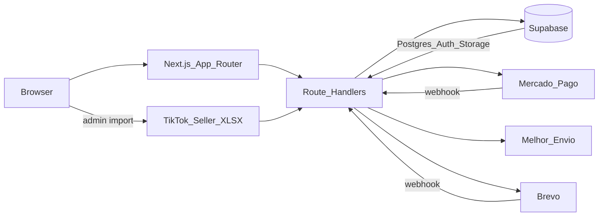

---

## Stack

| Camada | Tecnologia |
|--------|------------|
| Framework | Next.js 16.2 (App Router) |
| UI | React 19.2, Tailwind CSS 4.3, Lucide, Fancyapps UI |
| Linguagem | TypeScript 5.9 |
| Validação | Zod 4 |
| Backend-as-a-service | Supabase (PostgreSQL, Auth, Storage) |
| Auth loja | Supabase Auth (e-mail + Google OAuth) |
| Auth admin | JWT (`jose`) + bcrypt em cookie httpOnly |
| Pagamentos | Mercado Pago (`@mercadopago/sdk-react`) |
| Frete | Melhor Envio |
| E-mail | Brevo |
| Import marketplace | `xlsx` (TikTok Seller Center) |
| Crypto | AES-256-GCM para secrets de integração |
| Deploy | Vercel → [www.feliora.com.br](https://www.feliora.com.br) |

---

## Segurança

- **RLS no Postgres** — catálogo público só lê o que está ativo/publicado; dados do cliente por `auth.uid()`; carrinho, settings e marketplace sem policies públicas (acesso via `service_role` nos Route Handlers)
- **Cookies httpOnly** — `feliora_sid` (carrinho), `feliora_admin_token` (admin); `sameSite=lax`, `secure` em produção
- **Credenciais de terceiros** — AES-256-GCM (`v1.iv.tag.payload`) antes de persistir no banco
- **LGPD (MVP)** — consentimento de cookies, política de privacidade, newsletter com opt-in desmarcado por padrão, analytics condicionado ao consentimento
- **Webhooks** — Mercado Pago, Brevo, Shopee e TikTok em rotas dedicadas com validação / token conforme o provedor
- **Headers de segurança** — configurados em `next.config.ts`

---

## Resultados

Números de tráfego / Lighthouse ainda não documentados no repositório — preferimos não inventar métricas.

O que é verificável no código e no deploy:

| Resultado | Evidência |
|-----------|-----------|
| Loja em produção no domínio próprio | [www.feliora.com.br](https://www.feliora.com.br) |
| Modelo de dados completo | **37 tabelas** em `supabase/` (`00`–`21`) |
| Estoque seguro sob concorrência | RPC `decrement_variant_stock` |
| Bridge TikTok → catálogo | Importador `.xlsx` + schema `marketplace_*` |
| SEO técnico de produto | JSON-LD Product no PDP |
| <!-- TODO: preencher com dado real --> | <!-- ex.: score Lighthouse, nº de SKUs importados, CWV --> |

---

## Screenshots

<p align="center"><b>Home</b> — hero full-bleed, marca e CTA</p>
<p align="center">
  
</p>

<p align="center"><b>Catálogo</b> — grid de produtos</p>
<p align="center">
  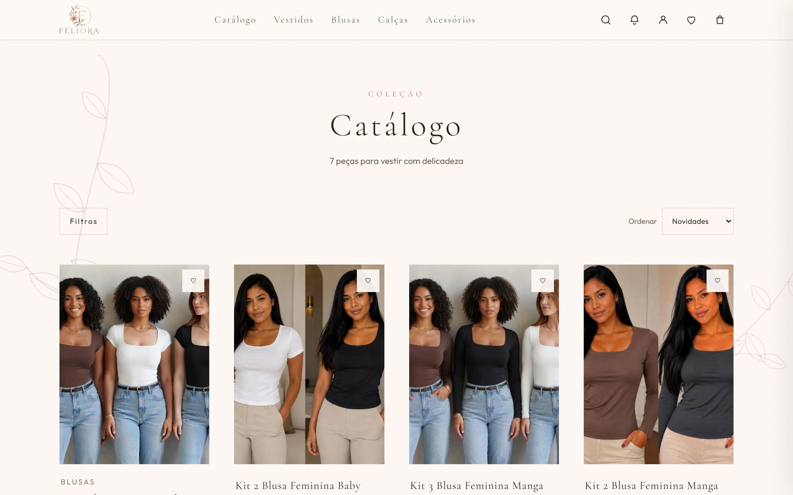
</p>

<p align="center"><b>Página de produto</b> — galeria, tamanhos e cores</p>
<p align="center">
  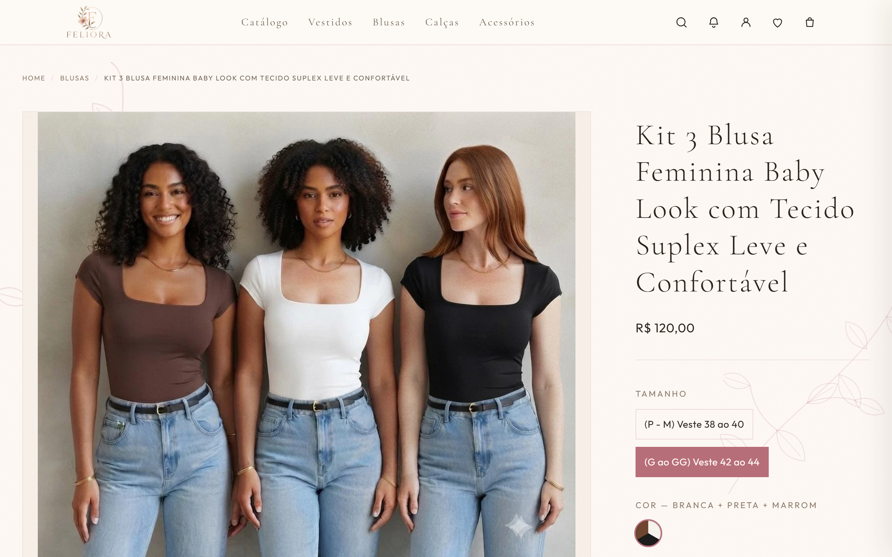
</p>

<p align="center"><b>Carrinho</b> — item, quantidade e resumo</p>
<p align="center">
  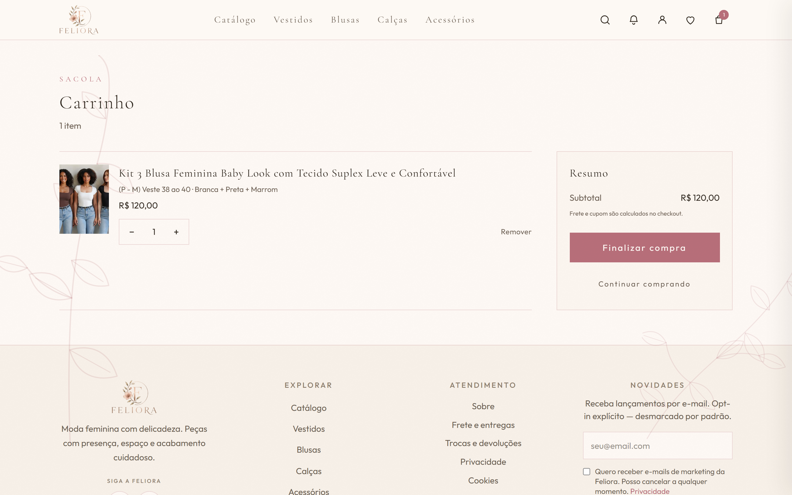
</p>

<p align="center"><b>Carrinho vazio</b> — empty state</p>
<p align="center">
  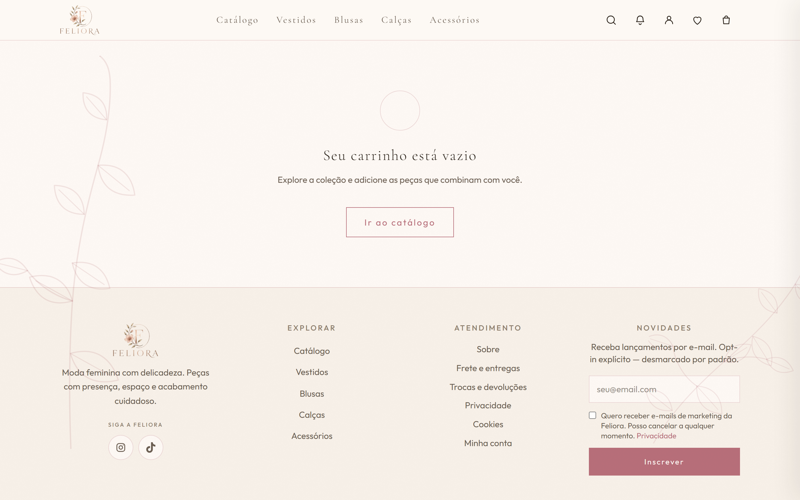
</p>

<p align="center"><b>Checkout</b> — exige autenticação (redirect para login com <code>?next=/checkout</code>)</p>
<p align="center">
  
</p>

<p align="center"><b>Conta do cliente</b> — login e-mail/senha e Google</p>
<p align="center">
  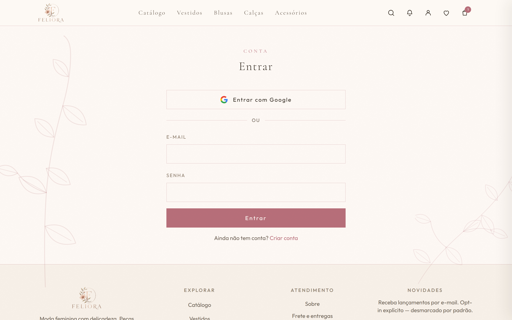
</p>

<p align="center"><b>Admin</b> — login do painel</p>
<p align="center">
  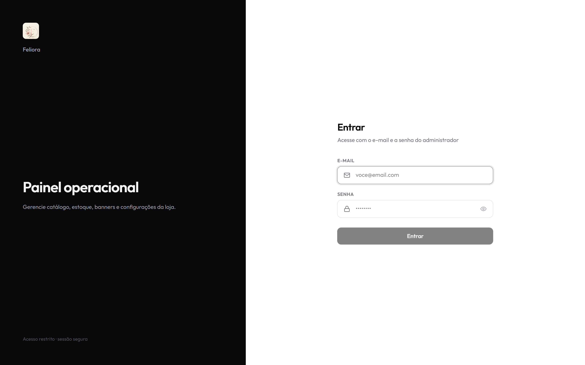
</p>

<p align="center"><b>Admin</b> — dashboard com analytics</p>
<p align="center">
  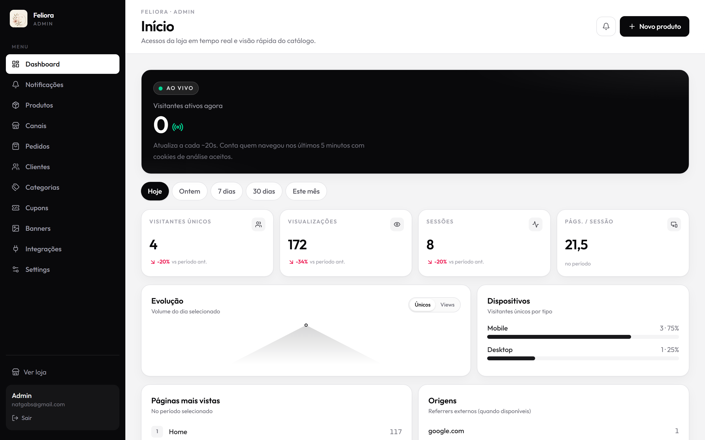
</p>

<p align="center"><b>Admin</b> — gestão de produtos</p>
<p align="center">
  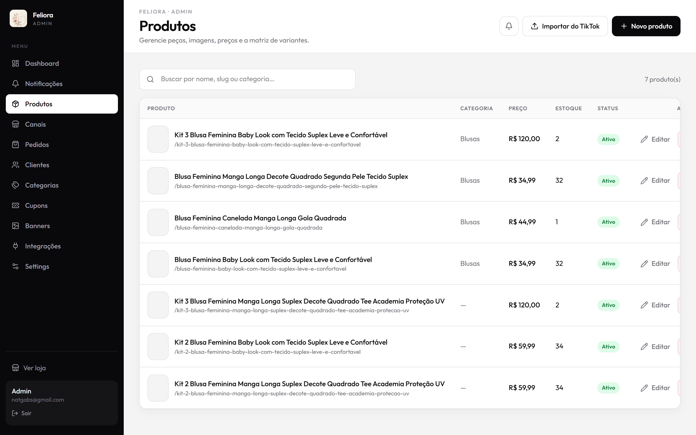
</p>

<p align="center"><b>Admin</b> — importador TikTok Shop (planilha .xlsx)</p>
<p align="center">
  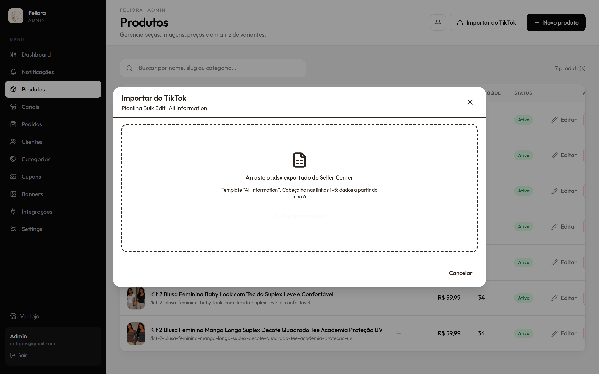
</p>

<p align="center"><b>Admin</b> — gestão de pedidos</p>
<p align="center">
  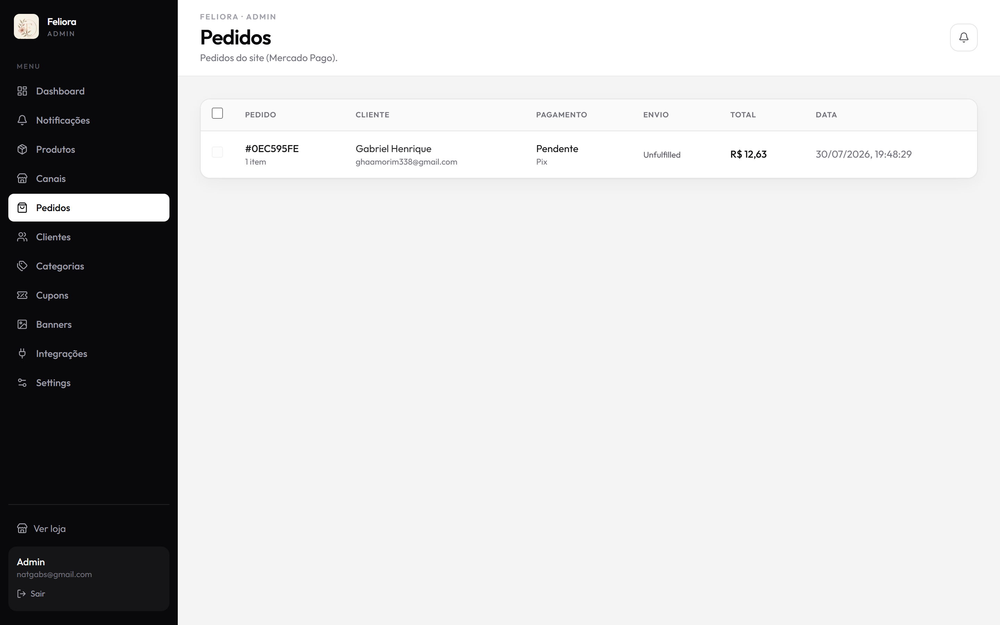
</p>

<p align="center"><b>Mobile</b> — home (390×844)</p>
<p align="center">
  
</p>

---

## Como rodar localmente

### Pré-requisitos

- Node.js 20+
- npm
- Projeto no [Supabase](https://supabase.com) com os scripts de `supabase/*.sql` na ordem numérica

### Setup

```bash
npm install
cp .env.example .env.local
# Preencha NEXT_PUBLIC_SUPABASE_*, SUPABASE_SECRET_KEY,
# ADMIN_JWT_SECRET, ADMIN_BOOTSTRAP_* e as ENCRYPTION_KEY (≥32 chars)
```

Execute os SQLs no SQL Editor do Supabase, na ordem `00` → `21` (ver [`supabase/README.md`](supabase/README.md)). Para catálogo de exemplo, rode também `09_seed_demo_optional.sql`.

```bash
npm run dev
```

Abra [http://localhost:3000](http://localhost:3000). Admin: [http://localhost:3000/admin/login](http://localhost:3000/admin/login).

| Comando | Descrição |
|---------|-----------|
| `npm run dev` | Dev server |
| `npm run build` | Build de produção |
| `npm run start` | Serve o build |
| `npm run lint` | ESLint |
| `npm run capture:screenshots` | Screenshots + GIF (Playwright) |

Detalhes de variáveis: [`.env.example`](.env.example).

---

## Decisões técnicas

| Problema | Solução |
|----------|---------|
| Combinações tamanho×cor com estoque real | Tabela `product_variants` + sync agregado no produto |
| Catálogo TikTok antes da API oficial | Import `.xlsx` + tabelas `marketplace_*` preparadas para o conector oficial |
| Carrinho visitante ↔ cliente | Cookie `feliora_sid` + merge em `/api/cart/merge` |
| Overselling | RPC `decrement_variant_stock` (`FOR UPDATE`, só `service_role`) |
| Secrets de MP / ME / Brevo / marketplaces | AES-256-GCM em colunas `*_encrypted` |
| Admin em Vercel serverless | JWT httpOnly (`feliora_admin_token`), sem sessão em memória |
| SEO de produto | JSON-LD Product + sitemap/robots + domínio canônico www |
| LGPD no MVP | Cookie consent + `/pages/privacidade` + opt-in marketing |
| Busca | Índice FTS (`search_vector`) no Postgres; query da loja ainda `ILIKE` (migração no roadmap) |
| Validação compartilhada | Schemas Zod em `src/shared/schemas` |

---

## O que aprendi

- **App Router do Next.js** como BFF: UI e Route Handlers no mesmo deploy, com fronteiras claras entre loja e admin
- **Modelagem relacional para moda**, tratando variante como SKU e produto como agregação de apresentação
- **Carrinho híbrido** em ambiente stateless (cookies httpOnly + merge idempotente)
- **RPCs e locks no Postgres** para estoque sob concorrência real de checkout e webhooks
- **Integrações de pagamento, frete e e-mail** com credenciais criptografadas e webhooks reconciliáveis
- **Bridge pragmática com marketplace** — planilha hoje, schema pronto para API amanhã
- **SEO e LGPD** como requisitos de MVP, não “fase 2”
- **Design system de marca** via CSS tokens no Tailwind 4, sem lutar contra um tema genérico

---

## Roadmap

- [ ] Ligar a busca da loja ao `search_vector` (FTS português) em vez de `ILIKE`
- [ ] Adotar a API oficial do TikTok Shop quando aprovada (substituir/complementar o XLSX)
- [ ] Expandir sync bidirecional de estoque/preço nos canais marketplace
- [ ] <!-- TODO: preencher com dado real --> Medir e publicar Core Web Vitals / Lighthouse
- [ ] Captura autenticada do formulário completo de checkout (endereço + frete + pagamento) para o portfólio

---

## Licença

MIT — veja [`LICENSE`](LICENSE).

---

<p align="center">
  Feito com Next.js, Supabase e Vercel · Moda feminina em código
</p>

---

## Captura automática de screenshots e vídeo

Os screenshots e o GIF deste README são gerados por Playwright:

```bash
npm run capture:install-browsers   # 1x
# opcional: FELIORA_URL (default https://www.feliora.com.br)
# admin: FELIORA_ADMIN_EMAIL / FELIORA_ADMIN_PASSWORD (ou ADMIN_BOOTSTRAP_* no .env.local)
npm run capture:screenshots
```

Arquivos em `docs/screenshots/`: `01-home.png` … `13-home-mobile.png`, `demo.webm` e `demo.gif` (se `ffmpeg` estiver no PATH).

Conversão manual do GIF, se necessário:

```bash
ffmpeg -y -i docs/screenshots/demo.webm -vf "fps=10,scale=800:-1:flags=lanczos" -loop 0 docs/screenshots/demo.gif
```
